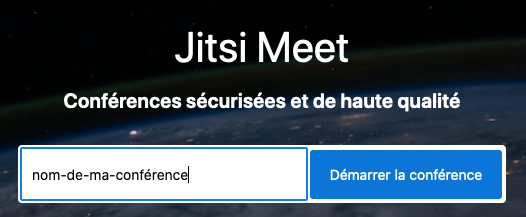
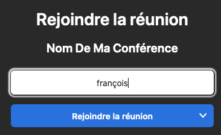
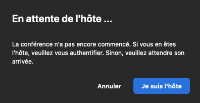
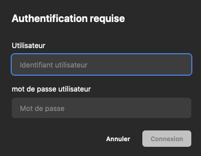
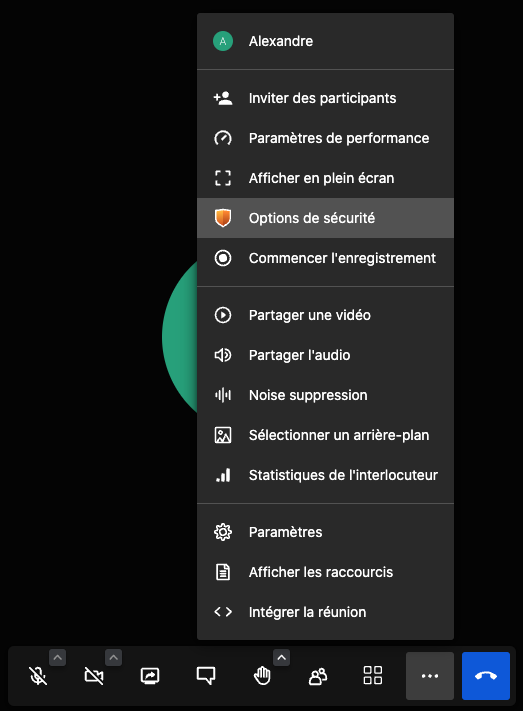
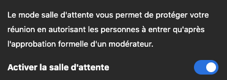

# Créer une conférence

Penser à autoriser l'application à accéder au micro et à la caméra.

- Se rendre sur [meet.reges.fr](https://meet.reges.fr).
- Entrer le nom de la réunion.

- Choisir un pseudo qui sera visible par les autres utilisateurs (à ne pas confondre avec le l'identifiant administrateur !)

- L'application vous demande si vous êtes un hôte (administrateur), cliquer sur `Je suis l'hôte`.

- S'authentifier avec les codes reçu par mail.

## Optionnel | Activer le mode salle d'attente

- Se placer en bas et afficher le menu. Puis cliquer sur `Options de sécurité`.

- Cocher la case :

